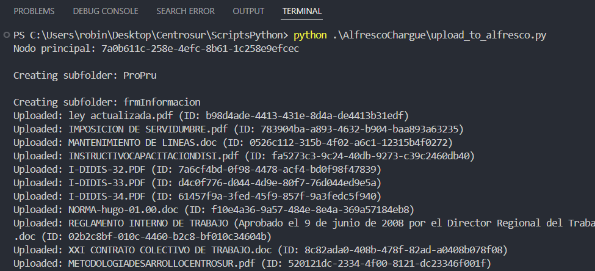
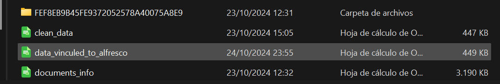

# Script para cargar adjuntos a Alfresco

Este proyecto contiene un cliente para interactuar con Alfresco y un script para subir documentos organizados en carpetas y subcarpetas a Alfresco desde un directorio local. El cliente permite crear carpetas, subcarpetas y subir archivos, además de verificar si estos elementos ya existen en Alfresco.

## Descripción del Flujo

1. **Verificación del directorio**: El script asegura que el directorio local existe y contiene las carpetas que deseas subir a Alfresco.
2. **Creación de carpetas en Alfresco**:
   - Se crea una carpeta principal en Alfresco según lo especificado en el script.
   - Se replican todas las subcarpetas del directorio local dentro de Alfresco.
3. **Carga de archivos**:
   - Se suben los archivos desde las subcarpetas locales a las carpetas correspondientes en Alfresco.
4. **Procesamiento de CSV**:
   - Si las subcarpetas contienen archivos `clean_data.csv`, estos se procesan para asociar los documentos correctos y subirlos a Alfresco.

## Funcionamiento Detallado

### Funciones Principales

- **`check_directory(path)`**:

  - Verifica si el path existe y es un directorio válido.
  - Imprime un mensaje de error si el directorio no es correcto.
- **`get_folders(path)`**:

  - Lista todas las carpetas y subcarpetas dentro del directorio local especificado.
  - Retorna la estructura de carpetas.
- **`create_main_folder(folder_name)`**:

  - Crea la carpeta principal en Alfresco donde se subirán todas las subcarpetas y archivos.
- **`create_subfolder(parent_id, subfolder_name)`**:

  - Crea subcarpetas dentro de Alfresco con el `parent_id` de la carpeta principal.
- **`upload_document_to_alfresco(parent_id, file_path)`**:

  - Sube archivos de documentos desde el directorio local a una carpeta en Alfresco identificada por su `parent_id`.
- **`process_csv_and_upload_attachments(csv_path, csv_name, parent_id_alfresco)`**:

  - Lee un archivo CSV y sube los documentos especificados dentro del CSV a la carpeta correspondiente en Alfresco.

## Ejemplo de ejecución

> En config/database_config.ini agregar el nodo principal con le que se  va a trabajar y el directorio desde donde se van a  tomar los archivos. Además tambipén es necesario agregar las  credenciales para la conexión al servidor donde se ejecuta ALFRESCO
>
> ```
> [ALFRESCO]
> URL = AF_URL
> USER = AF_USER
> PASSWORD = AF_PASSWORD
> # Tiempo de espera en segundos
> REQUEST_TIMEOUT = 5
> # Número máximo de reintentos
> MAX_RETRIES = 3
>
> [DIRECTORIES]
> #Nodo principal para la estructura de alfresco
> MAIN_NODE = Test_1
> #Carpeta principal donde se  están descargando los datos de Domino
> MAIN_DIRECTORIE = C:/Users/robin/Desktop/Centrosur/RespaldoDomino
> ```
>
> Ejecute el script
>
> ```
> python .\AlfrescoChargue\upload_to_alfresco.py
> ```
>

El código se ejecuta iterando en las carpetas dentro del directorio que se le indique. En caso de agregár mas  datos de domino, solo volver a ejecutar, ya que si se  hallan carpetas repetidas dentro se excluye la subida de  datos.



En Alfresco se  puede observar la creación del nodo principal, sus subcarpetas y los archivos que se han subido.


En el directorio local, en cada carpeta correspondiente a un form se genera el csv data_to_alfresco.csv que vincula la información que se tiene por docuemento con el archivo adjunto que se ha cargado a Alfresco.



### Contribuciones

¡Gracias por usar este proyecto! Si tienes algún problema o sugerencia, no dudes en abrir un issue o contribuir al proyecto.

<div align="center">
  <h3>Gerardo Arpi</h3>
  <p>Computer Science Engineer | Full Stack Developer | Data Analyst</p>
  <h3>Contact Me</h3>
  <a href="https://www.linkedin.com/in/robinson-arpi">
    
  </a>
  <a href="https://wa.me/593998320642" target="_blank">
    
  </a>
  <a href="mailto:robinson.arpi@gmail.com">
    
  </a>
</div>

```mermaid

```
