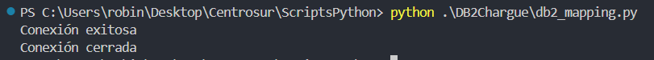
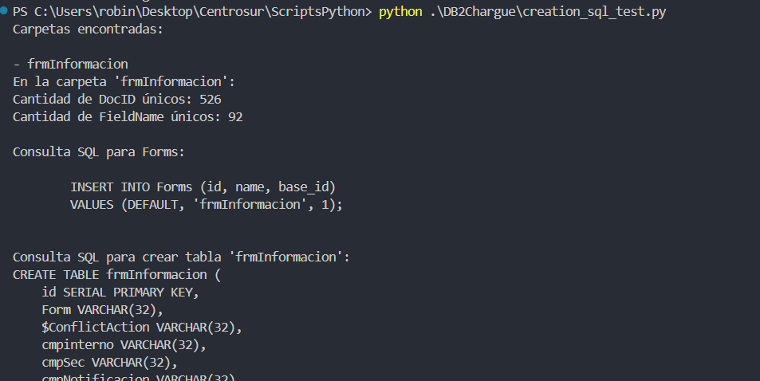

# Script para Carga de  datos con vínculo a alfresco hacia  DB2

El repositorio [https://github.com/robinson-arpi/db2-python-setup.git]() contiene más información sobre el desarrollo de la conexión a DB2, así como los drivers necesarios para su configuración.

## Ejemplo de ejecución

> En config/configurations.ini agregamos las credenciales necesarias.
>
> ```
> #Credenciales para constants.py
>
> # Credenciales para DB2
> [DATABASE]
> DRIVER = {iSeries Access ODBC Driver}
> HOST = xxx.xx.xxx.xxx
> DATABASE = db_name
> UID = db_user
> PWD = db_password
>
> [DIRECTORIES]
> #Cambiar path para cada base de datos
> PATH_FOR_NSF = C:/Users/robin/Desktop/Centrosur/RespaldoDomino/ProPru
> ```
>
> En DB2Chargue/db/queries.py se debe implementar el código necesario para realizar los inserts o selects.
>
> Ejecute el script
>
> ```
> python .\DB2Chargue\db2_mapping.py
> ```
>
> 

El archivo creation_sql_test.py contiene código donde se realizaban pruebas para construir el sql necesario apra crear las tablas en base al arcvhivo documents_info.csv. Es necesario recrearlo para el archivo data_vintuled_to_alfresco.csv que contiene la información completa.


