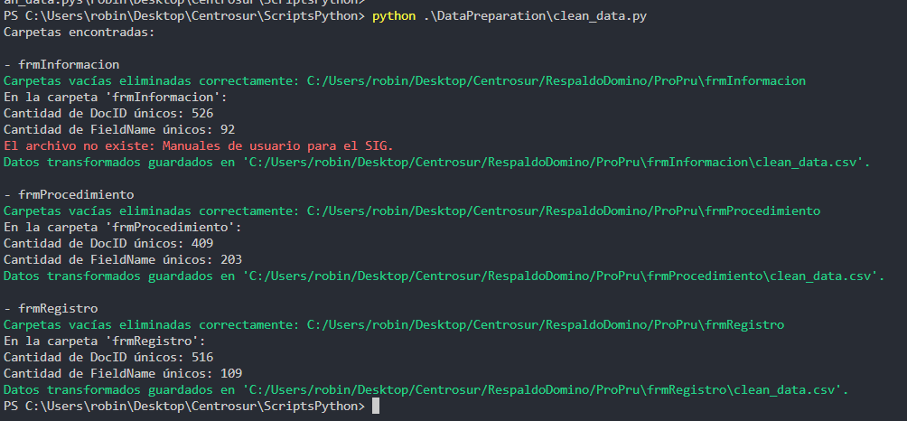
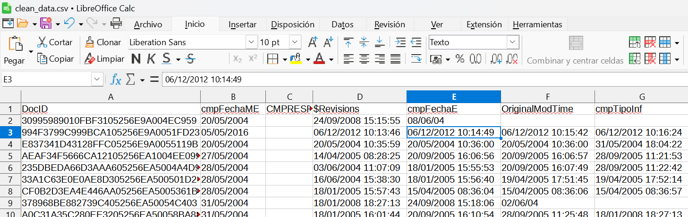

# Script para Limpieza de CSV generado por Agente Java

Este script en Python está diseñado para procesar archivos CSV que generó el agente  de lotus domino.

1. **Verificación del directorio**: Asegura que el directorio especificado existe y es válido.
2. **Listado de carpetas**: Muestra las carpetas dentro del directorio.
3. **Análisis de archivos CSV**:
   - Lee el archivo `documents_info.csv` en cada carpeta.
   - Filtra y transforma los datos:
     - Elimina la columna `cmpunidp` si está presente.
     - Reemplaza el contenido de las celdas con caracteres ilegibles por el valor `1`.
     - Elimina las columnas vacías.
     - Renombra archivos duplicados para evitar colisiones.
   - Guarda los datos transformados en un nuevo archivo CSV llamado `clean_data.csv`.

## Funcionamiento Detallado

### Funciones Principales

- **`check_directory(path)`**:

  - Verifica si el path existe y si es un directorio.
  - Imprime un mensaje de error si el directorio no existe o no es válido.
- **`review_directory(path)`**:

  - Lista todas las carpetas en el directorio dado.
  - Llama a analyze_file para procesar los archivos CSV dentro de cada carpeta.
- **`read_csv(archive)`**:

  - Lee un archivo CSV usando Pandas.
  - Maneja errores durante la lectura, como archivos corruptos o con formato incorrecto.
- **`is_unreadable_character(text)`**:

  - Determina si un texto contiene caracteres ilegibles usando una expresión regular.
- **`data_transform(df, field_names)`**:

  - Transforma los datos en el DataFrame:
  - Elimina la columna cmpunidp si está presente.
  - Reemplaza celdas con caracteres ilegibles por el valor 1.
  - Reordena las columnas para que DocID sea la primera.
- **`rename_duplicates(df, column)`**:

  - Renombra archivos con nombres duplicados dentro del DataFrame para evitar conflictos de nombres.
- **`analyze_file(path, carpeta_nombre)`**:

  - Analiza el archivo documents_info.csv en la carpeta dada:
  - Lee el archivo CSV.
  - Transforma los datos con data_transform.
  - Elimina columnas vacías.
  - Guarda los datos transformados en un archivo llamado clean_data.csv.
- **`delete_empty_folders(folder_path)`**:

  - Elimina carpetas vacías dentro de un directorio.

## Ejemplo de ejecución

> En config/database_config.ini agregar el path con le que se  va a trabajar. Continuando con le ejemplo presentado colocamos el directorio ProPru
>
> ```
> [DIRECTORIES]
> PATH = C:/Users/robin/Desktop/Centrosur/RespaldoDomino/ProPru
> ```
>
> Ejecute el script
>
> ```
> python .\DataPreparation\clean_data.py
> ```

El código se ejecuta iterando en todas las carpetas dentro de ProPru



En cada carpeta correspondiente a los formularios se creará un csv llamado clean_data.csv

## Notas Adicionales

Asegúrate de que todas las carpetas en el directorio especificado contengan archivos documents_info.csv para que el script funcione correctamente.
El script asume que el archivo CSV contiene las columnas `DocID`, `FieldName`, y `FieldValue`.

## Contribuciones

¡Gracias por usar este proyecto! Si tienes algún problema o sugerencia, no dudes en abrir un issue o contribuir al proyecto.

<div align="center">
  <h3>Gerardo Arpi</h3>
  <p>Computer Science Engineer | Full Stack Developer | Data Analyst</p>
  <h3>Contact Me</h3>
  <a href="https://www.linkedin.com/in/robinson-arpi">
    
  </a>
  <a href="https://wa.me/593998320642" target="_blank">
    
  </a>
  <a href="mailto:robinson.arpi@gmail.com">
    
  </a>
</div>
