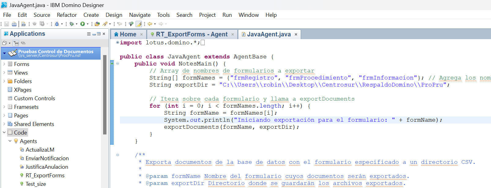
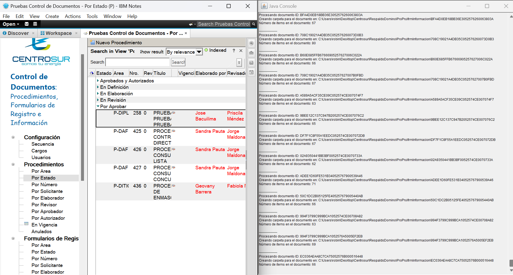
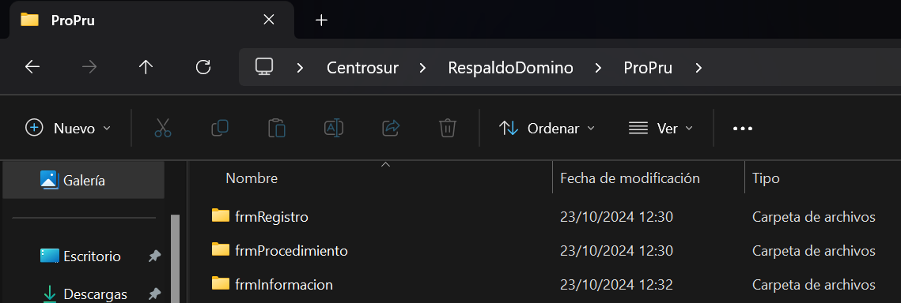
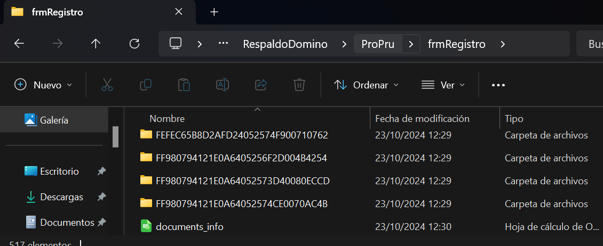
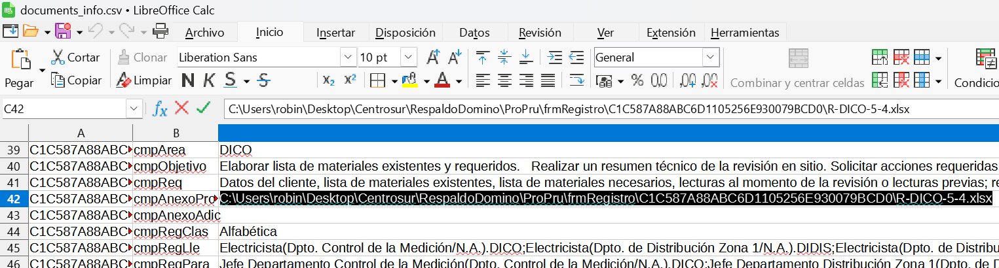

# Exportador de Documentos de Lotus Notes a CSV

Este código contiene un agente en Java para Lotus Domino que permite exportar documentos de una base de datos Lotus Notes con formularios específicos, guardando tanto los datos de los campos como los archivos adjuntos en un formato legible y estructurado (CSV).

## Estructura del Código

El agente realiza las siguientes acciones:

1. Itera sobre una lista de nombres de formularios predefinidos.
2. Busca todos los documentos de la base de datos que usan esos formularios.
3. Exporta los datos de los campos de los documentos a archivos CSV.
4. Extrae y guarda cualquier archivo adjunto embebido dentro de los campos de tipo `RichText`.

### Funciones principales

- **exportDocuments(String formName, String exportDir)**:

  - Exporta documentos de un formulario dado a un archivo CSV.
  - Cada documento tiene una carpeta asignada dentro del directorio de exportación que almacena sus archivos adjuntos.
  - Se guarda el contenido de los campos en formato CSV con codificación UTF-8.
- **escapeCsv(String value)**:

  - Escapa caracteres especiales y elimina saltos de línea en los valores de los campos, garantizando que el formato CSV sea válido.

## Requisitos

Para ejecutar este agente, necesitarás:

- IBM Domino Server con soporte para Java.
- Acceso a una base de datos Lotus Notes.

## Estructura de los Archivos Exportados

El agente crea una carpeta por cada formulario en el directorio que se le especifique (preferentemenete que exportDir lleve por nombre la base de datos para tener todo mejor estructurado). Dentro de estas carpetas:

- Se genera una carpeta por cada documento hallado, esta lleva por nombre el ID del documento y dentro tiene los archivos adjuntos que existan.
- Se genera un archivo CSV llamado `documents_info.csv`, que contiene los campos extraidos de cada documento y un campo para vincularlo a la carpeta que contiene sus adjuntos. Para facilitar la lectura el archvio tiene la estrcutura de: DocID, FieldName, FielValue.

```
📁exportDir
└── 📁fmr1
    └── documents_info.csv
    └── 📁[DocumentID1]
	└── attachment1.pdf
    	└── attachment2.docx
    └── 📁[DocumentID2]
	└── attachment1.jpg
    	└── attachment2.docx
    └── ...
└── 📁fmr2
    └── 📁...
```

## Configuración

### Directorio de Exportación

Asegúrate de modificar la ruta del directorio de exportación en el código:

String exportDir = "C:\\Users\\robin\\Desktop\\Centrosur\\RespaldoDomino\\ProPru";

Esta ruta debe existir en tu sistema o el agente intentará crearla automáticamente.

### Nombres de los Formularios

La lista de formularios a exportar se encuentra en esta parte del código:
String[] formNames = {"frmRegistro", "frmProcedimiento", "frmInformacion"};

Modifica los nombres de los formularios de acuerdo a los formularios que desees exportar.

## Ejemplo de ejecución

El agente debe ser agregado en cada base de  datos donde se vaya a trabajar.  Por ejemplo

* Abrimos IBM domino Designer y en la base de datos procpru.nsf agregamos el agente java. En este caso se llama RT_ExportForms.
* Le indicamos los forms a extraer (frmRegistro, frmProcedimiento, frmInformación).
* Le indicamos el directorio dónde se realizará la extracción, en este caso "C:\Users\robin\Desktop\Centrosur\RespaldoDomino\ProPru".
* Una vez el agente esté en la base de datos, vamos al workspace, abrimos la base correspondiente y en acciones ejecutamos el agente:
* Con el java debug abierto podemos observar ciertos mensajes mientras se realiza la extracción:

  
* Al finalizar en el directorio especificado se almacenarán los archivos extraidos 


* Dentro esta el csv y las carpetas de cada documento 
* Docuemnts_info contiene la información extraída junto la vinculación a sus adjuntos correspodientes:

## Notas

Los campos de tipo RichText se procesan y los archivos adjuntos incrustados se extraen.
Los saltos de línea en los valores de los campos son eliminados y las comillas dobles son escapadas para mantener la integridad del archivo CSV.

## Contribuciones

Las mejoras y sugerencias son bienvenidas. No dudes en realizar un fork de este repositorio y enviar tus pull requests.
